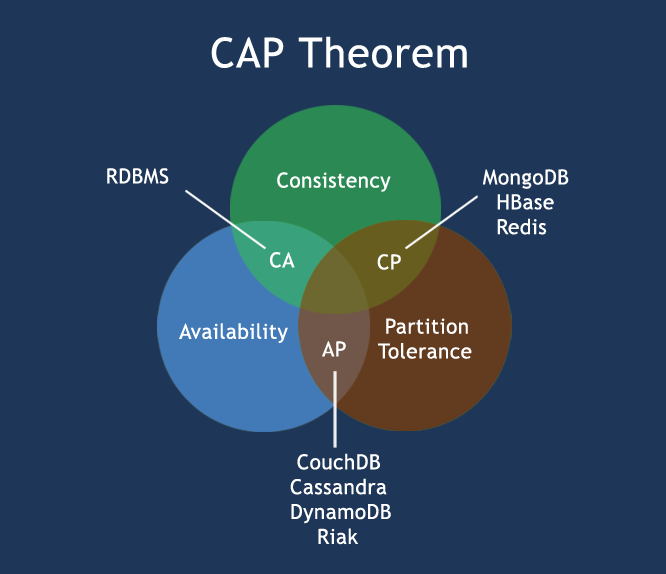

#Mongodb知识总结

##介绍
### 1. 关系型数据库ACID原则
```bash
1.A(Atomic)原子性
要不都执行，要不都不执行，数据保持原子性操作，不可分割
例如 A给B转100元，A-100,B+100,当B+100数据库操作失败时，A-100的操作也不提交事务
2.C(Consistence)一致性
数据必须保持一致性
3.I(Isolation)
#隔离级别：（读未提交，读已提交，可重复读，序列化）
4.D(Durability)
#持久化，防止数据丢失

```
### CAP定理(布鲁尔定理)
```bash
一致性（所有节点在同一时间点有相同的数据）

可用性（保证每个请求不管成功或者失败都有响应）

分区容错性（系统中的任意信息的丢失或者失败不会影响系统的继续运作）

CAP核心：一个分布式系统不能很好的满足CAP理论，最多只能较好的满足两个，
Base理论：对可用性和一致性的弱要求
Basically Availble :基本可用
Soft-state 软状态，柔性事务
Eventual Consistency:最终一致性 ACID的目的

CA:单点集群，满足一致性和可用性系统，通常在扩展性上不太强
CP:满足一致性和分区容错性，通常在性能上不是特别高
AP:满足可用性和分区容错性，通常在一致性不是特别高
```



